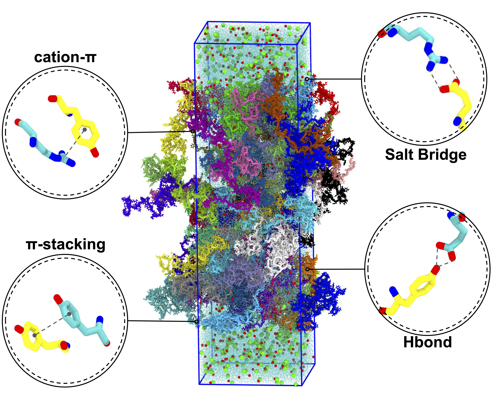

# README: Condensate dynamics of MUT16 using Cascade Computing

---



## Background:
 MUT16 acts as a primary scaffold within *C. elegans* mutator foci.  MUT-16’s Foci Forming Region (FFR) is essential for the formation of condensates that recruit downstream siRNA amplification machinery [1]. This study elucidates the **molecular grammar of MUT16-FFR** phase separation by quantifying **residue-residue contact frequencies** and **contact lifetimes**, while characterizing the specific regulatory role of ion associations in condensate formation. For this we analyse us-long atomistic molecular dynamics simulations.This is computationally challenging as the many interactions need to be tracked for large atomistic structures over MD-trajectory data in the order of microseconds, which we address with cascade-computing.

 previous work:

 [1] Gaurav K, Busetto V, Páez-Moscoso D ...Multi-scale simulations of MUT-16 scaffold protein phase separation and client recognition Biophysical Journal, 2025; 124, 3987-4004 https://doi.org/10.1016/j.bpj.2025.08.001

## Publication: https://doi.org/10.5281/zenodo.19219063

## Cascade computing: 
We use Signac to build an extendable HPC-optimized workflow for high-throughput contact analysis in MD simulations. This reproducable approach streamlines MD trajectory processing by eliminating redundant data traversals and ensuring flexible downstream analysis based on a single contact record file.

* **Contact records:** Contact features are stored as metadata alongside contact data (HDF5).
* **Conditional contact maps:** Organized with respect to protein species, amino-acid pairs, or residue IDs (pandas).

It can easily be extended to the needs of the user by adding individual functions to the signac workflow (see instructions below).


## Explore examples


### Tiny example in Binder (no-installation)
To get an idea of our contact evaluation you can play around with a small contact-table and plot lifetimes as well as frequencies.
The dataset does not include a full system so keep in mind, that some amino-acid pairs are not included.

[](https://mybinder.org/v2/gh/comp-mol-biol/cascade_computing/MUT16_FFR_v0.1?urlpath=%2Fdoc%2Ftree%2Fexamples%2Ftiny_example_MUT16_FFR.ipynb)


### MUT16-FFR example

Download the corresponding dataset (MUT16_FFR_atm_analysis_part.zip) from `https://zenodo.org/uploads/19239689` and unpack the folder into the examples directory - then open & run: 
```bash
examples/minimal_example_MUT16_FFR.ipnyb
```

You might have to set the path to your cascade_computing directory.
The examples shows you what the results of the analysis can look like:

* what does the contact record include
* how are the contact frequencies and lifetimes saved
* how to evaluate the corresponding distributions


## 1. Cascade computing: Environment Setup & Run

First, create an isolated environment. Replace `yourname` with your preferred environment name (e.g., `sim_env`).

```bash
python -m venv yourname

```

### Activate the Environment

Activate the environment:

**Bash:**

```bash
source ./yourname/bin/activate

```

### Install Dependencies

Install the required packages using the provided requirements files. Ensure you provide the correct path to your files.

**For Cascade Computing (CC):**

```bash
pip install -r ./cascade_computing/requirements.txt

```

### Create IPython Kernel 
Create a kernel that you can use inside Jupyter Lab to use your enviroment

```bash
python -m ipykernel install --user --name=yourname --display-name "cc_kernel"

```

### Run Jupyter lab
Jupyter lab runs in the local browser

```bash
jupyer lab &

```
or you can direct it to a port on your HPC system

```bash
nohup jupyter notebook --no-browser --port=8008 &
```
in the second case you need to log onto your HPC system with the same port: `ssh -L 8008:localhost:8008 yourHPC`.

Check if its running using:
```bash
jupyer notebook list

```


## 2. Tests
Download the corresponding dataset (data.zip) from `https://zenodo.org/uploads/19239689 and unpack the folder into the examples directory.  There are two test scripts included, that you can use to get insight into the contact calculations.
The first one in
```bash
tests/unit_test.ipnyb
```
shows contact calculations and runs a small example that calculated also specific bond interaction.
The second one in 
```bash
tests/debug_test.ipnyb
```
allows you to verify agains pre-computed data, in case you modify or extend your version of the code. 


## 3. Run analysis on your data

Open 

```bash
`setup_analysis.ipynb`
```

then start by configuring your local paths, the notebook will guide you through the setup. 

1. **Repository Path**: Set `path_git` to your local clone of the `cascade_computing` repository.
2. **Project Name**: Set `p_name` to a unique identifier (e.g., `'MUT16_MUT8'`). This creates a dedicated workspace for your project.

---

### System Requirements & Configuration

To analyze your system, you must specify the proteins and their structural properties.

### Protein Specification

For every protein in your system, create a configuration dictionary including:

* **`prot`**: The name of the protein.
* **`file`**: Path to the full-length PDB file.
* **`orig_na`**: Total amino acids in the original full-length protein.
* **`cut_na`**: Number of amino acids in the simulated fragment.
* **`min`** / **`max`**: The residue indices in the full-length protein defining your simulated fragment.

### Domain Mapping

If your proteins contain specific domains (e.g., `NTERM`), define them using boundary columns. Use `DOM_MIN` and `DOM_MAX` to define the start and end residues relative to the full sequence.

**Example Configuration:**

```python
domains = ['NTERM', 'FULL']

mut16 = {
    'prot': "MUT16",
    'orig_na': 2204,
    'cut_na': 140,
    'min': 633,
    'max': 772,
    'NTERM_MIN': 633,
    'NTERM_MAX': 700,
    'file': f"{path_input}/{filenameA}.pdb"
}

```

### The df_domains Reference Table

The notebook aggregates these dictionaries into a `df_domains` table. This serves as the primary metadata source, allowing the notebook to automatically extract amino acid sequences and map analysis results to specific domains or amino-acid types.

---

## 4. Running Signac Operations

### Load the Project

The notebook connects to project. It looks for a `.signac/config` file in your directory to identify the project.

```python
import signac
project = signac.get_project()

```

### Filter and Select Jobs

You can filter all your jobs for specific proteins or concentrations, thus define a scope of your operations:

```python
# Select all jobs
for job in project:
    pass

# Filter for a specific protein
for job in project.find_jobs({'prot': 'MUT16'}):
    pass

```

### Execute Operations

Use the `project.run()` method for your choice of jobs.

**Example: Running a contact analysis**

```python
project.run(
    names=['contacts'], 
    jobs=[job], 
    progress=True, 
    num_passes=1, 
    order="by-job"
)

```

**Parameter Breakdown:**

* **`names`**: List of operation names to execute (e.g., `['transform', 'contacts']`).
* **`jobs`**: A list containing the specific job object(s) to run.
* **`progress`**: Set to `True` for a progress bar.
* **`order="by-job"`**: Executes all operations for one job before moving to the next.

---

## 6. Available Operations

The project at this point includes the following operations:

* **`post_processing`**: Sets up the analysis framework.
* **`transform`**: Trajectory transformation (centering, PBC wrapping).
* **`contacts`**`: Computing residue-residue contact maps.
* **`eval_contacts`**: Contact evaluation and creation of the contact record
* **`analysis`**: Downstream analysis e.g. pivot tables from the contact record
* **`visualization`**: Generating plots .

**Note on Modifications:** To modify these or extend these functions, edit the source file located at:
`cascade_computing/src/compute/signac/sgnc.py`
